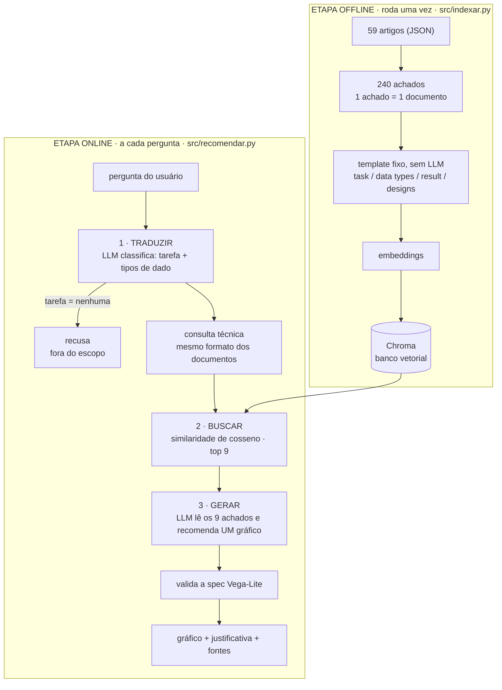

# Recomendador de Visualizações via RAG

Um sistema que recomenda **um gráfico** para quem **não é especialista**, a partir de
uma pergunta em linguagem do dia a dia. A recomendação vem de estudos científicos
sobre percepção de gráficos ([Zeng et al., CHI 2023](https://github.com/Zehua-Zeng/graphical-perception-knowledge)),
recuperados por RAG — não de regras fixas.

## O problema: a base e o usuário falam línguas diferentes

A base descreve os estudos em notação técnica:

```
task: characterize-distribution
result, best to worst: (E-4 = E-5 = E-6) > (E-1 = E-2 = E-3) > ...
- E-4: mark area-rect; quantitative -> length; nominal -> positionX
```

O usuário pergunta *"quero mostrar a distribuição das idades dos meus clientes"*.
Os dois textos não têm palavras nem conceitos em comum na superfície, então a
similaridade de cosseno entre eles não significa muita coisa.

## A solução: traduzir a pergunta, não a base

Em vez de reescrever os 240 achados da base, o sistema traduz **a pergunta** para o
vocabulário técnico da base, e só então busca:

```
pergunta leiga:     "quero mostrar a distribuição das idades dos meus clientes"
        ↓ LLM classifica (não recomenda nada)
consulta técnica:   task: characterize-distribution
                    data types: quantitative
                    analysis: show how a quantitative variable is distributed
```

Agora pergunta e documentos usam os mesmos termos, e o cosseno volta a medir o que
interessa. A base fica **intacta**: nenhum artigo é reescrito por LLM.

## Pipeline



**Custo por pergunta:** 2 chamadas de LLM (traduzir + gerar) e 1 embedding.
Pergunta fora do escopo: 1 chamada de LLM, sem busca.

## Arquivos

```
src/
  config.py         chave de API, modelos, nova tentativa em caso de erro temporário
  indexar.py        etapa offline: base → documentos → embeddings → Chroma
  recomendar.py     etapa online: traduzir → buscar → gerar
  validate_spec.py  confere e conserta a spec Vega-Lite
app.py              interface (Streamlit)
data/raw/           os 59 JSONs da base, intactos
tests/
  teste_offline.py      testa o pipeline inteiro sem gastar API
  comparar_v1_v2.py     compara esta versão com a v1 nas 18 perguntas
  test_questions.md     perguntas de avaliação + gabarito aproximado
  resultados_v1.json    respostas da v1, para a comparação
```

## Como rodar

```bash
python3 -m venv .venv && .venv/bin/pip install -r requirements.txt
```

```bash
cp .env.example .env
```

Preencha `GOOGLE_API_KEY` no `.env` (chave em https://aistudio.google.com/apikey).
Uma chave só cobre chat e embeddings.

```bash
.venv/bin/python src/indexar.py
```

Roda uma vez, leva uns 6 minutos (o plano gratuito aceita ~100 embeddings por minuto).

```bash
.venv/bin/streamlit run app.py
```

Ou pelo terminal:

```bash
.venv/bin/python src/recomendar.py "quero comparar as vendas de 5 categorias"
```

## Versão anterior (v1)

A primeira versão está guardada na branch
[`v1-cards-placar`](https://github.com/karibeam/Viz_rec_rag/tree/v1-cards-placar).
Ela resolvia o gap pelo outro lado: um LLM reescrevia os 240 achados em "cards" com
linguagem leiga, e um placar em Python decidia o gráfico. Funcionava, mas exigia
várias camadas extras (pesos, amortecimento por artigo, piso de escopo). A v2 troca
isso por um passo só: traduzir a pergunta.
